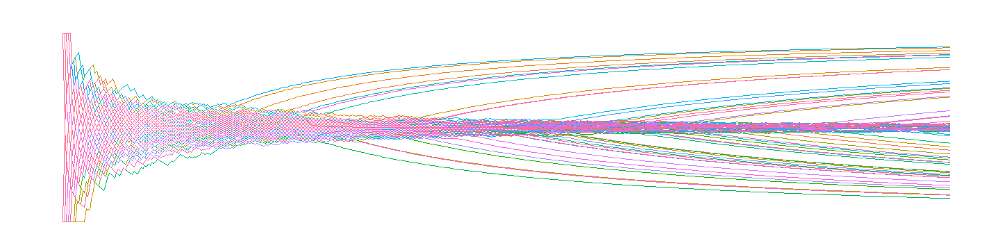

```{r setup, include=FALSE}
knitr::opts_chunk$set(echo = FALSE)
library(LSDinterface)
library(tidyverse)
library(forecast)
library(ggthemes)
```

<h1 style="font-size: 300%; text-align: center; font-family: optima;">Macroeconomia <br><br> Baseada em Agentes</h1>

<br>

```{r title-page-plot, layout="l-page", eval=T, fig.width=15, fig.asp=.25}

```
